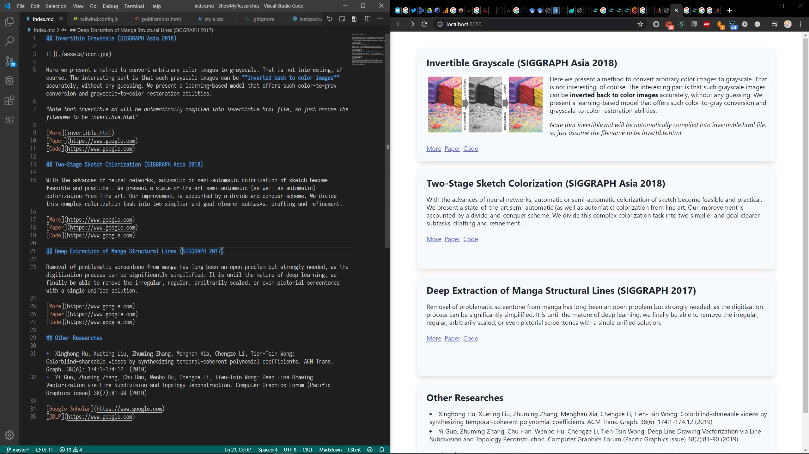

ShowMyResearches
----

## Overview

This is a very simple toolkit based on Markdown to generate your research project showcases. This tool features:

+  Markdown support for super-easy page generation
+  Predefined responsive styles with tailwind.css
+  Customizable single-project page, with responsive themes

## How to use

We have present you two template files:

1.  index.md (for generate card-based project views, we assume you can write basic Markdown documents)
2.  singlePage/colorize.html (for generate single project page. You can simply paste to replace, or customize your own components)

Note that only files mentioned in index.md will be generated to the final build folder. ALL HTML files uses *index.css* as style reference so it includes both overall-view and singlePage view. Replace the file(s) with your own and move to the next step.

## Build

Once you have prepared the pages, just run

    yarn
    yarn run build
    
The project folder will locates in the *build/* folder. Copy to your web server and it works >w<.

## Screenshot

