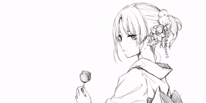
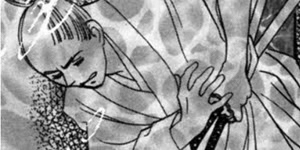
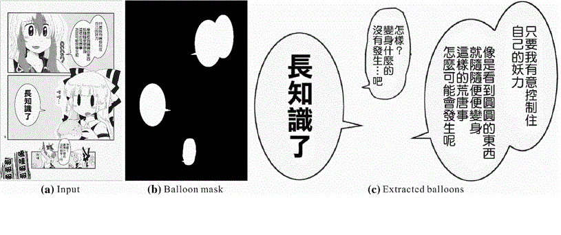

## Two-Stage Sketch Colorization (SIGGRAPH Asia 2018)

With the advances of neural networks, automatic or semi-automatic colorization of sketch become feasible and practical. We present a state-of-the-art semi-automatic (as well as automatic) colorization from line art. Our improvement is accounted by a divide-and-conquer scheme. We divide this complex colorization task into two simplier and goal-clearer subtasks, drafting and refinement.

[More](require('./singlePage/colorize.html'))
[Paper](https://mangaedt-bkt.oss-cn-shenzhen.aliyuncs.com/moekame_assets/colorize.pdf)
[Video](https://mangaedt-bkt.oss-cn-shenzhen.aliyuncs.com/moekame_assets/colorize.mp4)
[Github(v3)](https://github.com/lllyasviel/style2paints)

## Deep Extraction of Manga Structural Lines (SIGGRAPH 2017)

Removal of problematic screentone from manga has long been an open problem but strongly needed, as the digitization process can be significantly simpilified. It is until the mature of deep learning, we finally be able to remove the irregular, regular, arbitrarily scaled, or even pictorial screentones with a single unified solution.

[More](require('./singlePage/linelearn.html'))
[Paper](https://mangaedt-bkt.oss-cn-shenzhen.aliyuncs.com/moekame_assets/linelearn.pdf)
[Github](https://github.com/ljsabc/MangaLineExtraction)

## Text-aware Balloon Extraction from Manga (The Visual Computer Journal)

Balloons are commonly used for better story telling in manga. For transcribing and manipulating balloons, it needs the artists to cut out each text balloon meticulously, and therefore it is quite labor-intensive and time-consuming. We propose an automatic approach to extract text balloons from manga images both accurately and effectively. We incorporate both *shape* and *text* properties in order to differentiate text blobs from texture blobs. We also managed to tackle the boundary issue in balloon extraction. An web application is built with this technology and has been received 20M+ characters, and counting.

[More](require('./singlePage/linelearn.html'))
[Paper](https://mangaedt-bkt.oss-cn-shenzhen.aliyuncs.com/moekame_assets/balloon.pdf)
[Demo](https://moeka.me/mangaEditor)

## Other Researches

+  Xinghong Hu, Xueting Liu, Zhuming Zhang, Menghan Xia, Chengze Li, Tien-Tsin Wong: Colorblind-shareable videos by synthesizing temporal-coherent polynomial coefficients. ACM Trans. Graph. 38(6): 174:1-174:12  (2019)
+  Yi Guo, Zhuming Zhang, Chu Han, Wenbo Hu, Chengze Li, Tien-Tsin Wong: Deep Line Drawing Vectorization via Line Subdivision and Topology Reconstruction. Computer Graphics Forum (Pacific Graphics issue) 38(7):81-90 (2019)
+  Xueting Liu, Chengze Li, Tien-Tsin Wong: Boundary-aware texture region segmentation from manga. Computational Visual Media 3(1): 61-71 (2017)

[Google Scholar](https://scholar.google.com/citations?user=YGm_OT4AAAAJ)
[DBLP](https://dblp.uni-trier.de/pers/hd/l/Li:Chengze)